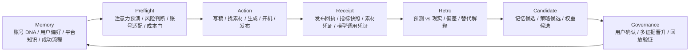

# 三核闭环架构：记忆 × 回执 × 预演

> 建立日期：2026-07-09
> 关联台账：`docs/ledgers/04-memory-learning-knowledge.md`、`docs/ledgers/05-content-publishing-feedback.md`、`docs/ledgers/15-influence-preflight-engine.md`
> 核心判断：Marketing OS 最核心的不是某个页面、某个模型、某个发布接口，而是三大系统组成的自我校准循环：记忆系统、数据回执系统、影响力预演引擎。

## 一、三者定位

可以把三大核心理解成：

| 核心 | 时间方向 | 负责什么 | 不能做什么 |
|---|---|---|---|
| 记忆系统 `Memory` | 过去 | 保存被证据支持的用户偏好、账号 DNA、成功流程、失败恢复、平台知识 | 不能把一次结果直接当真理；不能静默改策略 |
| 数据回执 `Receipt` | 现实 | 记录真实发生过的动作、发布结果、平台指标、素材来源、模型调用、审批结果 | 不能解释因果；不能被事后改写 |
| 预演引擎 `Preflight` | 未来 | 在行动前预测注意力、信任、行动、账号适配、风险和成本 | 不能冒充事实；不能绕过证据和授权 |

一句话：

```text
Memory tells what we have learned.
Receipt tells what actually happened.
Preflight tells what we should try next.
```

中文表达：

```text
记忆管“我们学到了什么”
回执管“现实发生了什么”
预演管“下一步值不值得做”
```

## 二、三生万物：核心循环



这个循环的关键不是“自动学习”四个字，而是每一步都有证据边界：

1. 记忆给预演提供上下文。
2. 预演在行动前下注。
3. 行动产生真实回执。
4. 回执打脸或验证预演。
5. 复盘生成候选，而不是直接改策略。
6. 候选经过确认、阈值或回放后进入记忆。
7. 下一轮预演变得更准。

## 三、三类真相不能混

系统里必须区分三类真相源：

| 真相类型 | 例子 | 存储/模块 | 规则 |
|---|---|---|---|
| 事实真相 | 发布 URL、post_id、播放量、完播率、素材 hash、API receipt | publishing tasks、effect receipts、metric snapshots、content asset receipts | 只记录，不解释；不可伪造未知值 |
| 解释真相 | “这个账号不适合泛娱乐热点”“用户经常拒绝标题党” | memory candidates、strategy candidates、account lifecycle | 必须有证据、scope、置信度、状态 |
| 预测真相 | 发布前预计播放/完播/信任/风险，InfluenceOS Score | content predictions、preflight records | 必须先于行动写入，行动后不可修改 |

如果这三类混掉，系统就会变成伪智能：

- 把一次播放高当成账号策略。
- 把模型预测当成事实。
- 把没有 post_id 的发布当成成功。
- 把用户一次拒绝当成永久偏好。
- 发布后改写预测，伪造“我早就知道”。

## 四、一次内容的完整生命周期

以一条不露脸视频为例：

```text
1. 读取记忆
   - 用户偏好：不喜欢标题党
   - 账号 DNA：AI 教育 / 普通人转型
   - 历史结果：案例型内容收藏率更高
   - 平台知识：抖音前 3 秒停留关键

2. 生成预演
   - 分析选题、脚本、镜头、素材、证据
   - 输出 attention / retention / trust / action / account_fit / risk
   - 生成 PreflightDecision：先补案例，再开机

3. 用户或 Agent 修改
   - 补真实案例
   - 换开头 hook
   - 替换廉价素材

4. 再次预演
   - 分数提升
   - 预测写入 immutable prediction

5. 执行动作
   - 找素材
   - 渲染样片
   - 生成配音
   - 用户授权发布

6. 保存回执
   - 素材 source/license/hash
   - TTS provider receipt
   - render command/output hash
   - publish receipt/post_id/url
   - 1h/6h/24h/3d/7d metric snapshots

7. 复盘
   - 预测完播 35%，实际 21%
   - 预测收藏中等，实际偏高
   - 可能原因：开头弱，但中段框架有保存价值

8. 生成候选
   - memory candidate：该账号“框架型内容收藏高，但开头停留弱”
   - strategy candidate：提高 hook 权重，增加前 3 秒冲突设计
   - weight candidate：RetentionDesign 权重需调整

9. 治理后进入记忆
   - 多次样本支持或用户确认后晋升
   - 下一轮预演自动参考
```

## 五、三大模块的数据合同

### 5.1 Memory 输入/输出

输入：

- 用户明确偏好。
- 用户拒绝、修改、采纳。
- 发布结果复盘。
- 失败恢复记录。
- 策略候选确认。
- 平台知识更新。

输出：

- 账号 DNA。
- 用户偏好。
- 禁区。
- 成功流程。
- 平台知识。
- 历史高/低表现模式。

硬边界：

- Agent 只能先写 pending candidate。
- 重要策略不能静默生效。
- 记忆必须带 scope：user/account/platform/project/content_type。

### 5.2 Receipt 输入/输出

输入：

- 工具执行结果。
- 发布平台返回或反查到的 post_id/URL。
- 指标 checkpoint。
- 素材下载/生成凭证。
- 模型调用凭证。
- 审批 grant。

输出：

- 可审计事实。
- 可复盘指标。
- 可回放生产链路。
- 可追责的动作记录。

硬边界：

- 回执不解释因果。
- 未知字段缺省，不写 0。
- 没有稳定 URL/post_id，不能冒充发布成功。
- API Key、Cookie、Token 不进入 receipt prose。

### 5.3 Preflight 输入/输出

输入：

- 记忆系统：账号 DNA、偏好、禁区、历史模式。
- 回执系统：历史指标、发布结果、素材/模型调用质量。
- 当前内容：标题、脚本、正文、EDL、素材、证据。
- 当前上下文：平台、热点、对标、发布时间、商业目标。

输出：

- InfluenceOS Score。
- attention/retention/trust/action/account_fit/risk 分项预测。
- why：为什么这么判断。
- recommended_fix：怎么改。
- decision：继续、先改、补证据、换素材、不开机、可发布。

硬边界：

- 预演只做行动前判断，不直接发布。
- 没有数据时输出低置信，不装懂。
- 预测写入后不可改。
- 权重升级必须通过回放验证。

## 六、核心公式：闭环不是直线

产品不是：

```text
生成内容 -> 发布 -> 看数据
```

而是：

```text
Memory_t
  -> Preflight_t
  -> Action_t
  -> Receipt_t
  -> Retro_t
  -> Candidate_t
  -> Governance_t
  -> Memory_{t+1}
```

进一步可以写成：

```text
Preflight_t = f(Content_t, Memory_t, ReceiptHistory_t, PlatformContext_t)
```

```text
Retro_t = compare(Preflight_t.prediction, Receipt_t.actual)
```

```text
Memory_{t+1} = govern(Memory_t, Retro_t, UserFeedback_t, EvidenceThreshold)
```

这就是“三生万物”的产品数学：

- 记忆提供历史。
- 预演提供假设。
- 回执提供现实。
- 复盘让三者不断校准。

## 七、产品层表现

用户不需要知道三核循环，但体验上应该感受到：

1. Agent 不是每次从零开始。
2. Agent 知道这个账号过去适合什么、不适合什么。
3. Agent 会在开机/发布前提醒风险。
4. Agent 会说“我为什么这么判断”。
5. Agent 发布后会回来对账，而不是忘掉。
6. Agent 会承认预测错了，并修正下一轮。
7. Agent 越用越像一个懂账号的运营总监。

UI 上可以体现为三个状态对象，底层过程默认收进对话“思考与执行”：

| UI 对象 | 对应核心 |
|---|---|
| 行动建议/思考过程 | Preflight |
| 回执/指标卡 | Receipt |
| 账号 DNA / 学习记录 | Memory |

工作台应该展示三者状态：

```text
今天建议做什么        -> 来自 Preflight
昨天发布结果怎么样    -> 来自 Receipt
系统学到了什么        -> 来自 Memory
```

## 八、开发落点

### 第一阶段：统一记录结构

| ID | 任务 | 目标 | 状态 |
|---|---|---|---|
| CORE-LOOP-01 | `PreflightRecord` 协议 | 预演结果可保存、可回放、可对账 | code done / automated verified |
| CORE-LOOP-02 | `ReceiptRef` 标准化 | 发布、素材、模型、渲染、审批都能引用统一 receipt | code done / automated verified |
| CORE-LOOP-03 | `LearningCandidate` 汇总层 | memory candidate、strategy candidate、weight candidate 同屏审核 | code done / automated verified |

### 第二阶段：打通一次内容闭环

| ID | 任务 | 目标 | 状态 |
|---|---|---|---|
| CORE-LOOP-04 | 内容生产前强制 Preflight | 软文/视频都先跑底层预演门 | code done / automated verified |
| CORE-LOOP-05 | 发布后强制 Receipt | 没有 receipt 不进入结果学习 | existing foundation / needs lane integration |
| CORE-LOOP-06 | Retro 自动对账 | prediction vs actual 自动生成复盘 | code done / automated verified |
| CORE-LOOP-07 | Candidate 治理 | 复盘只生成候选，等待确认或多证据晋升 | code done / automated verified |

### 第三阶段：产品化

| ID | 任务 | 目标 |
|---|---|---|
| CORE-LOOP-08 | 工作台三核状态 | 今日预演、最新回执、最新学习并列展示 |
| CORE-LOOP-09 | 内容工厂预演门 | “开始创作/开机/发布”前内部判断风险，主回复只交付结论 |
| CORE-LOOP-10 | 账号经营复盘 | 每周汇总：预测准了什么、错了什么、学到了什么 |

## 九、与现有代码/台账的对应

| 核心 | 已有地基 | 缺口 |
|---|---|---|
| Memory | `memory_candidates`、typed memory events、promotion/supersede/rejection、`learning_pipeline` pending result memory、`learning_candidates` 指标复盘候选、`weight` 学习候选治理 | 用户治理 UI、策略候选晋升、多样本回放 |
| Receipt | publishing receipt、effect receipt、metric checkpoint、素材/音频/render receipt、指标缺失语义 | 真人稳定回放、统一 ReceiptRef、更多平台 adapter |
| Preflight | content scoring、blind prediction、InfluenceOS Score v0、内容生产工单、内容生产总预演、独立高阶视频片子预演、prediction vs actual 自动对账、PreflightDecision | feature snapshot、思考过程折叠与主回复去噪 |

## 十、边界纪律

1. 回执是事实，不是结论。
2. 记忆是解释，不是原始证据。
3. 预演是假设，不是事实。
4. 复盘是比较，不是自动归因。
5. 策略改变是候选，不是静默更新。
6. 任何学习都必须能追溯到 receipt、prediction、user feedback 或多证据事件。
7. 任何预测都必须能被未来打脸。

## 十一、一句话总结

三大核心组成一个闭环：

```text
记忆让系统不失忆；
回执让系统不撒谎；
预演让系统不盲动。
```

三者循环起来，才是 Marketing OS 真正的智能体内核。

## 十二、2026-07-09 落地记录

本轮已把第一阶段从架构文档落到 AgentCoreStore：

代码路径：

- `engine/agent_core/store.py`
  - 新增表：`receipt_refs`、`preflight_records`、`learning_candidates`
  - 新增方法：`create/get/list_receipt_ref(s)`、`create/get/list_preflight_record(s)`、`mark_preflight_used`
  - 新增方法：`create/get/list/decide_learning_candidate`
  - 发布完成自动写 `publish_receipt` 引用
  - 指标快照自动写 `metric_snapshot` 引用
  - effect 执行回执自动写 effect receipt 引用
- `engine/agent_core/migrations.py`
  - 新增 migration marker v22：`CORE-LOOP-01/02/03`
- `engine/agent_core/policy.py`
  - 新增 `marketing_prepare_` 只读准备能力前缀，避免内容生产预演/渲染准备工具被默认拒绝。
- `tests/test_core_loop_three_engines.py`
  - 覆盖预演记录、回执引用、学习候选、显式记忆晋升四个最小闭环行为。

验证证据：

```text
.venv/bin/python -m pytest tests/test_core_loop_three_engines.py -q
4 passed

.venv/bin/python -m pytest tests/test_run18_blind_prediction.py tests/test_learning_pipeline_integration.py tests/test_publishing.py tests/test_desk_09_migrations.py -q
56 passed

.venv/bin/python -m pytest -q
1255 passed, 1 warning
```

当前完成口径：

- `PreflightRecord` 已可写入、读取、列表查询、标记已用于行动。
- `ReceiptRef` 已可统一引用发布、指标、effect 等真实回执，并做幂等去重与敏感字段脱敏。
- `LearningCandidate` 已可把预演、预测、回执聚合成待治理候选，但不会静默写入正式记忆。

下一步：

1. `CORE-LOOP-09 / IPE-07`：三条内容生产 lane 全部以 `PreflightDecision` 为入口。
2. `CORE-LOOP-08/09`：工作台和内容工厂展示三核状态，不再只是“按钮 + 文本框”。
3. `IPE-08/09`：对话思考折叠、主回复去噪与权重候选回放升级。

## 十三、2026-07-09 落地记录：内容生产总预演与高阶视频片子预演分离

状态：`CORE-LOOP-04 / IPE-03 code done / automated verified`

本轮把内容生产前的预演接入了三核闭环，并明确拆成两层：

1. 总内容预演 `content_business_preflight`
   - 模块：`engine/agent_core/production_preflight.py`
   - 工具：`marketing_draft_content_preflight`
   - API：`POST /api/marketing-os/content/production/preflight`
   - 写入：`preflight_records`
   - 负责：受众、证据、平台、生产可行性、成本安全、是否进入内容草稿。

2. 高阶视频片子预演 `film_previsualization`
   - 模块：`engine/video_core/high_end_preflight.py`
   - Agent：`high_end_video_previsualization_agent`
   - 不写营销系统表，不引用账号/发布/记忆。
   - 负责：剧本到影像、镜头可行性、美术连续性、节奏样片、声音时序、预算门。

边界纪律：

- 总预演可以说“这条内容作为账号经营动作是否值得开始”。
- 片子预演可以说“这条片子作为影像作品是否成立”。
- premium human video 必须委派片子预演；总预演不能把镜头、节奏、美术、连续性塞进 Marketing OS 总分。
- `PreflightRecord.scores` 只保存总预演分数；片子预演结果作为独立报告返回/展示。

验证证据：

```text
.venv/bin/python -m pytest tests/test_production_preflight.py tests/test_content_production.py tests/test_product_closure_guard.py -q
相关测试通过

.venv/bin/python -m pytest -q
1261 passed, 1 warning
```

## 十四、2026-07-09 落地记录：指标标签化与自动复盘候选

状态：`CORE-LOOP-06 / IPE-04 code done / automated verified`

本轮把真实指标回收到三核闭环里：

1. 指标标签化
   - 模块：`engine/agent_core/learning_pipeline.py`
   - 函数：`build_metric_labels`
   - 将 `views`、`completion_rate`、`engagement_rate`、互动、行动、负反馈等真实指标转为：
     - `attention`
     - `retention`
     - `trust`
     - `action`
     - `fit`
     - `risk`
   - 缺失维度进入 `missing_dimensions`，不把未知值写成 0。

2. 自动复盘
   - `store.collect_metrics(...)` 写入 `publishing_metric_snapshots` 后，会把刚写入的 snapshot 交给 `reconcile_published_metrics(...)`。
   - `content_predictions.record_retro(...)` 只写 retro，不改写原始 prediction。
   - `engagement_rate` 已纳入可对账指标。

3. 学习候选
   - 指标复盘会创建 pending `learning_candidate`。
   - 候选引用：
     - `publishing_task`
     - `metric_snapshot`
     - `prediction`
     - 可选 `preflight`
     - 兼容旧 `memory_candidate`
   - 候选只是观察，不静默晋升正式记忆或策略权重。

4. Agent 可读入口
   - 工具：`marketing_read_learning_candidates`
   - API：`GET /api/plugins/marketing-os/learning/candidates`

验证证据：

```text
.venv/bin/python -m pytest tests/test_learning_pipeline_integration.py tests/test_server.py::test_sql_publishing_metrics_endpoint_collects_checkpoint_and_learning tests/test_publishing.py::test_publishing_task_lifecycle tests/test_run18_blind_prediction.py tests/test_run19_retro_reconciliation.py tests/test_run_12_13_14.py tests/test_agent_core.py::test_tool_manifest_all_have_valid_levels tests/test_agent_core.py::test_only_implemented_tools_are_registered tests/test_agent_core.py::test_controlled_tools_count -q
65 passed, 1 warning
```

## 十五、2026-07-09 落地记录：候选治理与 InfluenceOS Score v0

状态：`CORE-LOOP-07 / IPE-05 code done / automated verified`

本轮把“复盘候选”推进成“可治理的权重候选”，并补上第一版可解释影响力分数。

1. InfluenceOS Score v0
   - 模块：`engine/agent_core/influence_score.py`
   - 版本：`influenceos-score-v0.1`
   - 分项：
     - `PlatformReachPotential`
     - `HumanAttentionKernel`
     - `RetentionDesign`
     - `PersuasionScore`
     - `SocialPropagation`
     - `AccountFit`
     - `BusinessValue`
     - `RiskPenalty`
   - 输入来源：
     - 最新内容评分 `content_scores`
     - 最新预演记录 `preflight_records`
     - 发布后指标标签 `metric_labels`
   - 输出：
     - 总分
     - 决策建议
     - 每个分项的 source / why
     - 缺失维度
     - 置信度

2. Candidate 治理
   - 模块：`engine/agent_core/learning_governance.py`
   - 版本：`learning-governance-v0.1`
   - 规则：
     - 单条复盘只生成 memory 类型观察候选。
     - 连续多条复盘出现同方向信号，才生成 `weight` 类型候选。
     - 默认阈值：3 条同类证据。
     - 已存在同类 pending 权重候选时不重复创建。
   - 第一批治理信号：
     - 有注意力但留存弱。
     - 有注意力但行动弱。
     - 信任/互动信号强。
     - 风险压力持续出现。
     - 预测连续过度乐观。
     - 预测连续偏保守。

3. 学习管线接入
   - `reconcile_published_metrics(...)` 在写 retro 时同步保存 `influence_score`。
   - 每次复盘后调用候选治理器。
   - 未达阈值时返回 `insufficient_evidence`。
   - 达阈值时创建 pending `weight` learning candidate。
   - 不直接改正式记忆、策略或权重。

4. Agent 可读入口
   - 工具：`marketing_read_influence_score`
   - API：`GET /api/plugins/marketing-os/influence/score`
   - 用途：Agent、内容工厂和未来 UI 可以读取同一套预演/复盘分数。

验证证据：

```text
.venv/bin/python -m pytest tests/test_influence_score_governance.py tests/test_learning_pipeline_integration.py tests/test_server.py::test_sql_publishing_metrics_endpoint_collects_checkpoint_and_learning tests/test_server.py::test_influence_score_endpoint_reads_asset_features tests/test_run_12_13_14.py tests/test_agent_core.py::test_tool_manifest_all_have_valid_levels tests/test_agent_core.py::test_only_implemented_tools_are_registered tests/test_agent_core.py::test_controlled_tools_count -q
32 passed, 1 warning
```

## 十六、2026-07-09 落地记录：统一 PreflightDecision

状态：`CORE-LOOP-09 / IPE-06 code done / automated verified`

本轮把 InfluenceOS Score 和产品动作拆开：

- Score 负责回答：这条内容/动作的影响力潜力、风险和缺失维度是什么。
- Decision 负责回答：现在应该生产、改稿、补证据、换素材、不开机、进入发布审批，还是委派高阶视频片子预演。

代码路径：

- `engine/agent_core/preflight_decision.py`
  - 新增统一决策合约 `preflight-decision-v0.1`。
  - 新增 `build_preflight_decision`、`build_asset_preflight_decision`、`build_score_preflight_decision`。
- `engine/agent_core/production_preflight.py`
  - 内容生产总预演返回 `influence_score` 和 `preflight_decision`。
  - 旧 `decision.status/go/next_action` 保留兼容。
- `engine/agent_core/tool_manifest.py`
  - 新增只读工具：`marketing_read_preflight_decision`。
- `engine/marketing-os/server.py`
  - 新增 `GET/POST /api/plugins/marketing-os/preflight/decision`。
- `electron/main.js`
  - 放行桌面桥接对应路径。
- `src/api/client.ts`
  - 新增 `api.preflightDecision` 和 `api.influenceScore`。

统一决策对象包含：

- `version`
- `stage`
- `status`
- `go`
- `action`
- `primary_reason`
- `next_action`
- `required_next_steps`
- `blockers`
- `warnings`
- `watch_metrics`
- `ui`

验证证据：

```text
.venv/bin/python -m pytest tests/test_preflight_decision.py tests/test_production_preflight.py tests/test_server.py::test_preflight_decision_endpoints_share_unified_contract tests/test_server.py::test_influence_score_endpoint_reads_asset_features tests/test_run_12_13_14.py tests/test_agent_core.py::test_tool_manifest_all_have_valid_levels tests/test_agent_core.py::test_only_implemented_tools_are_registered tests/test_agent_core.py::test_controlled_tools_count -q
33 passed, 1 warning

./node_modules/.bin/tsc --noEmit && node --check electron/main.js && node --check electron/preload.js
passed

.venv/bin/python -m pytest -q
1271 passed, 1 warning
```

下一步：

1. `CORE-LOOP-09 / IPE-07`：三条内容生产 lane 全部以 `PreflightDecision` 为入口。
2. `IPE-08`：对话思考折叠与预演去噪，不把预演门做成主 UI 卡片。
3. `IPE-09`：候选权重进入历史回放/审批后再真正升级。

## 十七、2026-07-09：内容生产入口的统一预演门

本轮把 `PreflightDecision` 从“可读/可测的决策对象”，推进成内容生产资产创建前的门禁。

核心变化：

- `article_soft` 与 `faceless_video` 的真实资产创建入口都先调用 `create_content_production_preflight(...)`。
- 决策摘要写入资产 `content.preflight_gate`，包括 `preflight_id`、`status`、`go`、`primary_reason`、`required_next_steps`、`blockers`、`warnings`、`influence_score`。
- 资产 `quality_gates` 末尾追加 `总预演门`：
  - `pass`：允许继续写评分和盲预测。
  - `blocked`：只保存阻断草稿，不写发布前预测。
- `premium_human_video` 仍不创建普通内容资产；总预演返回 `delegate_to_video_previsualization`，片子级判断继续交给独立高阶视频预演 Agent。

这使三大核心循环开始咬合：

1. 记忆/账号 DNA 提供受众与偏好。
2. 预演门决定是否开机、缺什么、风险在哪。
3. 通过后的内容才进入发布前预测、回执、复盘和学习候选。

验证证据：

```text
.venv/bin/python -m pytest tests/test_content_production.py tests/test_production_preflight.py tests/test_preflight_decision.py -q
27 passed

.venv/bin/python -m pytest -q
1272 passed, 1 warning
```

## 十八、2026-07-09：预演不上主 UI，折叠进对话思考

本轮修正一个产品表达方向：预演门是底层智能，不是一个需要在工作台/内容工厂上单独展示的主 UI 模块。

新边界：

- 用户主视线只看 Agent 的结论、理由、产物 ID、缺失条件和下一步。
- 计划、工具调用、证据读取、预演状态等过程信息默认收进对话里的“思考与执行”。
- 用户需要追查时可以展开；默认不让底层日志破坏对话体验。
- 内容工厂仍会内部要求 Agent 走 `marketing_draft_content_preflight`，但最终回复不应原样输出工具名、数据库字段或预演流水账。

对应代码：

- `src/components/AgentPanel.tsx`
- `src/index.css`
- `src/pages/Creator.tsx`
- `tests/test_product_closure_guard.py`

验证证据：

```text
.venv/bin/python -m pytest tests/test_product_closure_guard.py -q
13 passed

./node_modules/.bin/tsc --noEmit
passed

.venv/bin/python -m pytest -q
1273 passed, 1 warning
```
